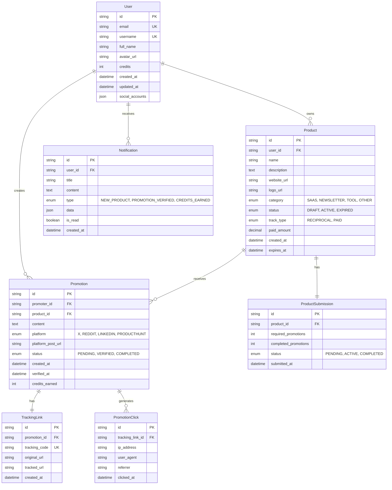
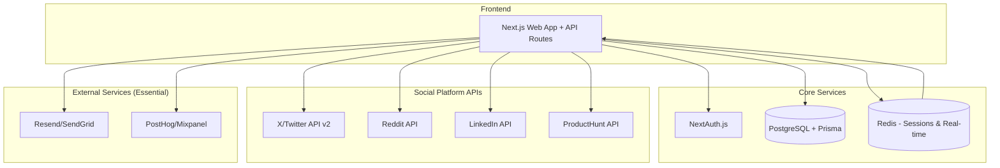
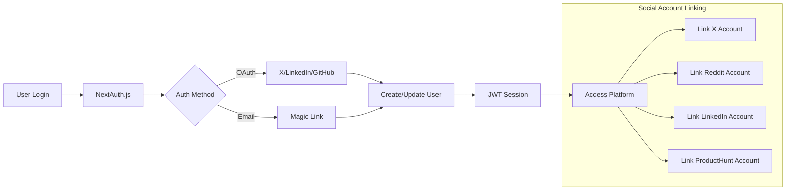
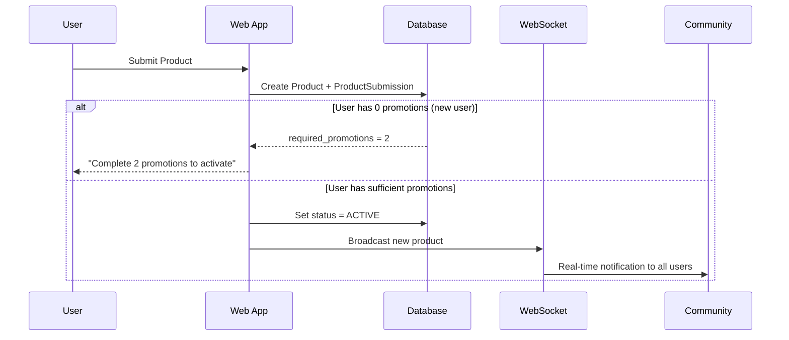
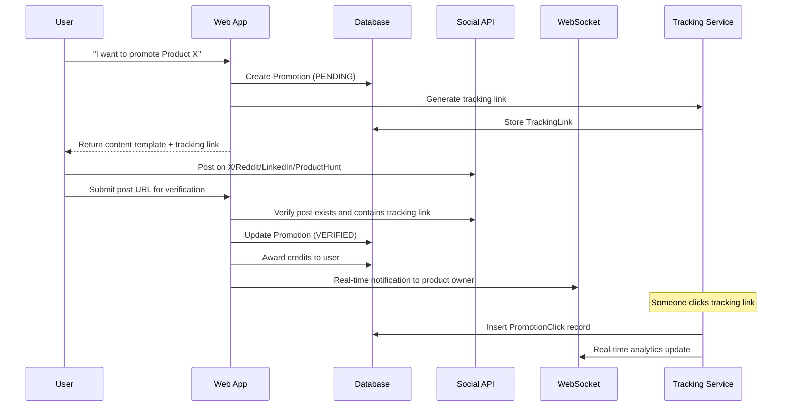
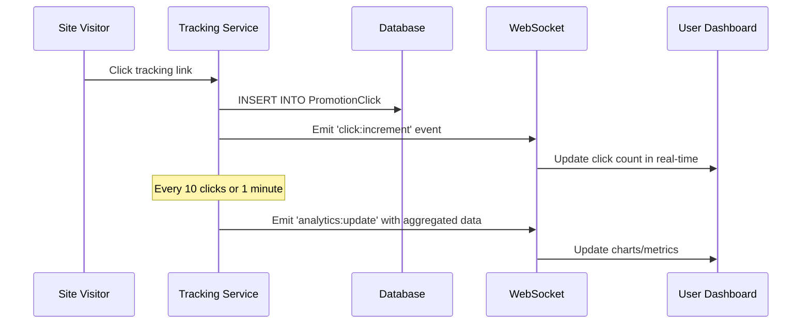
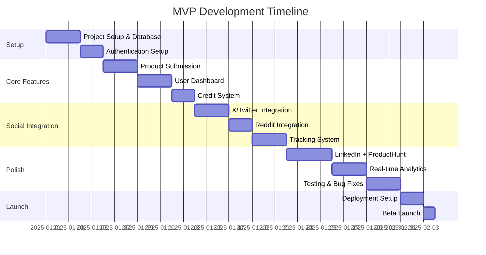

# Cross-Promotion Platform: MVP Architecture

## System Overview

This document outlines the **MVP architecture** for a cross-promotion platform built as a Next.js monorepo, focusing on core functionality with X/Twitter, Reddit, LinkedIn, and ProductHunt integrations, real-time analytics, and essential features only.

## 1. MVP Monorepo Structure (Simplified)

```
cross-promo-mvp/
├── apps/
│   └── web/                    # Main Next.js application (includes API routes)
├── packages/
│   ├── ui/                     # Essential UI components only
│   ├── database/               # Prisma schema (core entities only)
│   ├── auth/                   # NextAuth.js setup
│   ├── social-integrations/    # X, Reddit, LinkedIn, ProductHunt APIs
│   └── tracking/               # Link tracking & real-time analytics
├── libs/
│   ├── types/                  # Core TypeScript definitions
│   └── config/                 # Environment configuration
└── prisma/
    ├── schema.prisma           # Database schema
    └── migrations/             # Database migrations
```

## 2. MVP Entity Relationship Diagram (Core Entities Only)



## 3. MVP System Architecture (Simplified)



## 4. MVP Authentication (Simplified)



### MVP Authentication Setup:
- **NextAuth.js** with X, LinkedIn, and GitHub OAuth
- **Magic link** for email-only users
- **Social account linking** stored in `user.social_accounts` JSON field
- **Simple role system**: User vs Admin (no premium tiers yet)

## 5. MVP Data Flow (Core Flows Only)

### Product Submission Flow (Reciprocal Track - MVP)



### Promotion Creation & Real-time Tracking (MVP)



### Real-time Analytics Flow (MVP)



## 6. MVP API Endpoints (Essential Only)

### Core API Routes
```typescript
// Authentication (NextAuth.js handles most of this)
GET  /api/auth/session           // Get current session
POST /api/auth/link-social       // Link social accounts

// Products
GET    /api/products             // List active products
POST   /api/products             // Submit new product  
GET    /api/products/:id         // Get product details
PUT    /api/products/:id         // Update own product

// Promotions
GET    /api/promotions           // List user's promotions
POST   /api/promotions           // Create new promotion
PUT    /api/promotions/:id/verify // Submit post URL for verification

// Tracking
GET    /api/track/:code          // Redirect tracking link
POST   /api/track/:code/click    // Log click event (called by redirect)

// Real-time Analytics
GET    /api/analytics/product/:id    // Get product click/promotion stats
GET    /api/analytics/promotion/:id  // Get promotion performance

// Notifications
GET    /api/notifications        // Get user notifications
PUT    /api/notifications/read   // Mark all as read

// Social Verification
POST   /api/verify/x            // Verify X/Twitter post
POST   /api/verify/reddit       // Verify Reddit post  
POST   /api/verify/linkedin     // Verify LinkedIn post
POST   /api/verify/producthunt  // Verify ProductHunt comment
```

### WebSocket Events (Real-time)
```typescript
// Client subscribes to these events
'product:new'           // New product available for promotion
'promotion:verified'    // Your promotion was verified
'analytics:update'      // Real-time click/view updates
'credits:earned'        // You earned credits
```

## 7. MVP Social Platform Integration

### Social API Integration Strategy

```typescript
// X/Twitter Integration (Primary)
interface TwitterIntegration {
  verifyTweet: (tweetUrl: string, trackingLink: string) => Promise<boolean>
  getTweetMetrics: (tweetId: string) => Promise<{likes: number, retweets: number}>
  postTemplateGeneration: (product: Product) => string
}

// Reddit Integration  
interface RedditIntegration {
  verifyPost: (postUrl: string, trackingLink: string) => Promise<boolean>
  suggestSubreddits: (category: string) => Promise<string[]>
  generatePostTemplate: (product: Product, subreddit: string) => string
}

// LinkedIn Integration
interface LinkedInIntegration {
  verifyPost: (postUrl: string, trackingLink: string) => Promise<boolean>
  getPostMetrics: (postId: string) => Promise<{likes: number, comments: number}>
  generateBusinessPost: (product: Product) => string
}

// ProductHunt Integration
interface ProductHuntIntegration {
  verifyComment: (commentUrl: string, trackingLink: string) => Promise<boolean>
  findRelevantProducts: (category: string) => Promise<ProductHuntProduct[]>
  generateSupportComment: (product: Product) => string
}
```

### Platform-Specific Verification Rules

```typescript
// Platform verification requirements
const verificationRules = {
  X: {
    mustContainTrackingLink: true,
    mustBeMention: false,
    mustUseHashtag: ['#IndieHacker', '#SaaS'], // optional
    minimumFollowers: 0 // MVP: no restrictions
  },
  Reddit: {
    mustContainTrackingLink: true,
    allowedSubreddits: ['r/SideProject', 'r/entrepreneur', 'r/SaaS'],
    mustNotBeSpam: true // check account age, karma
  },
  LinkedIn: {
    mustContainTrackingLink: true,
    mustBeProfessionalTone: false, // MVP: no AI checking
    mustBePublic: true
  },
  ProductHunt: {
    mustBeComment: true,
    mustContainTrackingLink: true,
    mustBeSupportive: true, // basic sentiment analysis
    mustBeOnRelevantProduct: false // MVP: any product
  }
}
```

## 8. MVP Database Schema (Essential Indexes)

### Critical Indexes for Performance
```sql
-- Essential MVP indexes
CREATE INDEX idx_products_status ON products(status);
CREATE INDEX idx_promotions_user ON promotions(promoter_id);
CREATE INDEX idx_promotions_product ON promotions(product_id);
CREATE INDEX idx_tracking_code ON tracking_links(tracking_code);
CREATE INDEX idx_clicks_timestamp ON promotion_clicks(clicked_at);
CREATE INDEX idx_notifications_user_read ON notifications(user_id, is_read);
```

### Real-time Analytics Query Optimization
```sql
-- Optimized queries for real-time dashboard
-- Get product promotion stats
SELECT 
  p.id,
  COUNT(pr.id) as promotion_count,
  COUNT(pc.id) as total_clicks
FROM products p
LEFT JOIN promotions pr ON p.id = pr.product_id 
LEFT JOIN tracking_links tl ON pr.id = tl.promotion_id
LEFT JOIN promotion_clicks pc ON tl.id = pc.tracking_link_id
WHERE p.status = 'ACTIVE'
GROUP BY p.id;

-- Get user promotion performance  
SELECT 
  u.username,
  COUNT(pr.id) as total_promotions,
  SUM(pr.credits_earned) as total_credits
FROM users u
JOIN promotions pr ON u.id = pr.promoter_id
WHERE pr.status = 'VERIFIED'
GROUP BY u.id, u.username;
```

## 9. MVP Security & Rate Limiting

### Essential Security Measures
```typescript
// Basic rate limiting for MVP
const rateLimits = {
  productSubmission: { max: 5, window: '1d' },    // 5 products per day
  promotionCreation: { max: 20, window: '1h' },   // 20 promotions per hour  
  linkTracking: { max: 1000, window: '1h' },      // 1000 clicks per hour
  apiGeneral: { max: 100, window: '15m' }         // 100 API calls per 15 min
}

// Social API verification security
const verificationSecurity = {
  validateDomain: true,        // Ensure URLs are from correct platforms
  sanitizeContent: true,       // Basic XSS protection
  checkAccountAge: true,       // Prevent new account spam (Reddit/LinkedIn)
  rateLimitVerifications: { max: 10, window: '1h' }
}
```

### Tracking Link Security
```typescript
// Generate secure tracking codes
function generateTrackingCode(): string {
  return crypto.randomBytes(8).toString('hex'); // 16 char random string
}

// Validate tracking requests
function validateTrackingRequest(code: string, referer?: string) {
  // Basic validation - more sophisticated in full version
  return /^[a-f0-9]{16}$/.test(code);
}
```

## 10. MVP Tech Stack & Dependencies

### Core Dependencies
```json
{
  "dependencies": {
    // Framework
    "next": "^14.0.0",
    "react": "^18.0.0",
    "typescript": "^5.0.0",
    
    // Database & ORM
    "@prisma/client": "^5.0.0",
    "prisma": "^5.0.0",
    
    // Authentication
    "next-auth": "^4.24.0",
    "@auth/prisma-adapter": "^1.0.0",
    
    // UI Framework
    "@radix-ui/react-*": "^1.0.0", // Essential components only
    "tailwindcss": "^3.3.0",
    "lucide-react": "^0.263.1",
    
    // Real-time & Caching  
    "socket.io": "^4.7.0",
    "redis": "^4.6.0",
    "ioredis": "^5.3.0",
    
    // Social Platform APIs
    "twitter-api-v2": "^1.15.0",
    "snoowrap": "^1.23.0",         // Reddit API
    "linkedin-api-client": "^1.0.0",
    
    // Utilities
    "zod": "^3.22.0",              // Validation
    "nanoid": "^4.0.0",            // Tracking code generation
    "date-fns": "^2.30.0"          // Date handling
  }
}
```

### Environment Configuration
```typescript
// .env.example for MVP
DATABASE_URL="postgresql://..."
REDIS_URL="redis://..."

NEXTAUTH_URL="http://localhost:3000"  
NEXTAUTH_SECRET="..."

// Social Platform APIs
TWITTER_CLIENT_ID="..."
TWITTER_CLIENT_SECRET="..."
REDDIT_CLIENT_ID="..."
REDDIT_CLIENT_SECRET="..."
LINKEDIN_CLIENT_ID="..."
LINKEDIN_CLIENT_SECRET="..."

// Optional for MVP
RESEND_API_KEY="..."              // Email notifications
POSTHOG_KEY="..."                 // Analytics
```

## 11. MVP Implementation Phases

### Phase 1: Core Foundation (Week 1-2)
```typescript
// Essential features for launch
const phase1Features = [
  '✅ Next.js app with Prisma setup',
  '✅ NextAuth.js with X/Twitter + GitHub OAuth', 
  '✅ Basic product submission form',
  '✅ User dashboard with credit system',
  '✅ PostgreSQL database with core tables',
  '✅ Basic UI with Tailwind + Radix'
];
```

### Phase 2: Social Integration (Week 3-4)
```typescript
const phase2Features = [
  '✅ X/Twitter post verification',
  '✅ Reddit post verification', 
  '✅ Tracking link generation & click logging',
  '✅ Real-time notifications with Socket.IO',
  '✅ Basic promotion creation flow',
  '✅ Credit earning/spending system'
];
```

### Phase 3: Platform Completion (Week 5-6)
```typescript
const phase3Features = [
  '✅ LinkedIn + ProductHunt integrations',
  '✅ Real-time analytics dashboard',
  '✅ Community product feed',
  '✅ Email notifications for key events',
  '✅ Mobile-responsive design',
  '✅ Basic admin panel for moderation'
];
```

## 12. MVP Success Metrics

### Key Performance Indicators
```typescript
interface MVPMetrics {
  // User Engagement
  dailyActiveUsers: number;
  productSubmissionsPerDay: number;
  promotionsPerDay: number;
  averagePromotionsPerUser: number;
  
  // Platform Health
  verificationSuccessRate: number;    // % of promotions verified
  clickThroughRate: number;           // Clicks per promotion
  userRetentionRate: number;          // 7-day retention
  
  // Business Metrics
  creditsCirculated: number;          // Total credits earned/spent
  platformGrowthRate: number;         // New users per week
}

// MVP Success Targets (Month 1)
const mvpTargets = {
  totalUsers: 100,
  activeProducts: 50,
  totalPromotions: 500,
  averageCTR: 0.02,                   // 2% click-through rate
  userRetention7Day: 0.3              // 30% week 1 retention
}
```

## 13. MVP Deployment Architecture

### Simple Deployment Stack
```yaml
# docker-compose.yml for MVP deployment
version: '3.8'
services:
  app:
    build: .
    environment:
      - DATABASE_URL=${DATABASE_URL}
      - REDIS_URL=${REDIS_URL}
    ports:
      - "3000:3000"
    
  postgres:
    image: postgres:15
    environment:
      POSTGRES_DB: crosspromo
      POSTGRES_USER: ${DB_USER}
      POSTGRES_PASSWORD: ${DB_PASSWORD}
    volumes:
      - postgres_data:/var/lib/postgresql/data
    
  redis:
    image: redis:7-alpine
    ports:
      - "6379:6379"
```

### MVP Infrastructure Recommendations
- **Hosting**: Vercel (Next.js optimized) or Railway
- **Database**: Supabase (PostgreSQL) or PlanetScale  
- **Redis**: Upstash (serverless Redis)
- **Domain**: Namecheap or Cloudflare
- **Monitoring**: PostHog (free tier) + Sentry

## 14. MVP Development Timeline

### 6-Week MVP Development Plan


This MVP architecture focuses on the essential functionality needed to validate your cross-promotion platform concept while keeping complexity manageable for rapid development and iteration.